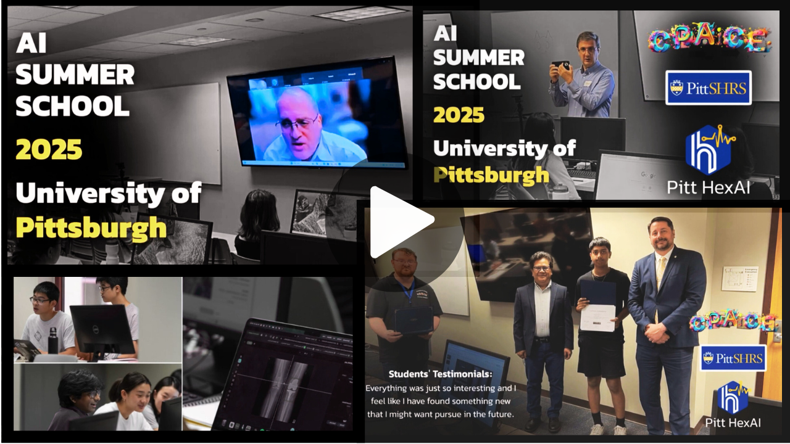

# AI Summer School; Medical Imaging Informatics

## Table of Contents
- [Abstract](#abstract)
- [Description](#description)
- [Agendas](#agendas)
- [AI Summer School Overview Video](#ai-summer-school-overview-video)
- [Acknowledgements](#acknowledgements)
- [Link to Download Liner.ai](#link-to-download-linerai)

### Abstract

 Our AI Summer School on AI-Powered Medical Imaging Informatics aims to provide a stimulating and unique opportunity for students in grades 11 and 12 to dive into the fascinating world of artificial intelligence (AI) and its application in medical imaging informatics. This summer school will be held between June 24 and June 28, 2024, at the University of Pittsburgh, organized by the Computational Pathology & AI Center of Excellence (CPACE) within the School of Medicine, plus the School of Health and Rehabilitation Sciences, and IEEE Computer Society in Pittsburgh. 

### Description

 Computer vision as a subfield of AI has been around for several years dealing with how computers can understand from digital images and video sequences. Advanced computer vision algorithms have already demonstrated successful applications in a variety of domains, including medical image interpretation, remote surgery, surveillance systems, security and biometrics, autonomous vehicles, and scene reconstruction, purposing to name a few. There is a list of fascinating problems in applied computer vision in medical imaging, with object detection and localization being one of the most interesting ones. Object detection and localization is now also widely associated with self-driving cars where automatic systems combine computer vision, LIDAR, and GPUs to generate a multidimensional representation of the road with all its participants. It is also commonly used in medical image analysis, video surveillance and monitoring, counting people for general statistics, and computationally analyze customer experience with walking patterns within shopping centers.
In this summer school, you will learn -from scratch- how to use advanced computer vision algorithms to tackle the problem of object detection and localization in medical images. We will discuss object detection mechanism(s) in practice with several hands-on-practices starting from manual image annotation to programming and implementation in Python. We, together, will explore what object detection computational vision algorithm is, what is does, and how. The current mini summer camp at the University of Pittsburgh is structured such that in addition to attending lectures, the students will be also working in teams on a project assignment. 

### Agendas
+ 
 Introduction to AI and Computer Vision 

+ 
Introduction to Deep Learning Computer Vision and Deep Convolutional Neural Networks (CNNs) 

+ 
Introduction to Object Detection and Localization in Computer Vision 

+ 
Introduction to PyTorch 

+ 
Manual Annotation of Medical Images (ITK-SNAP, Label Studio) 

+ 
Object Localization (Sliding Windows, Bounding Boxes, YOLO, SSD) Or Object Segmentation (U-Net and ResNet) 

+ 
Liner.ai; Liner is an end-to-end tool for training machine learning models without code 

### AI Summer School Overview Video

  

### Acknowledgements

We gratefully acknowledge the <b>Computational Pathology & AI Center of Excellence (CPACE)</b>, the <b>University of Pittsburgh School of Health and Rehabilitation Sciences</b>, and the <b>IEEE Pittsburgh section</b> for organizing and supporting the AI Summer School.  
We also extend our appreciation to all the invited speakers, contributors, and our visionary leadership, whose efforts and dedication made this program a success.  

### Link to Download Liner.ai

https://liner.ai

   
  <b>Pitt Health + Explainable AI (Pitt HexAI) Research Laboratory</b>

